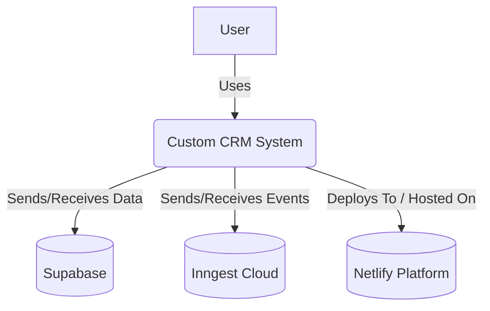
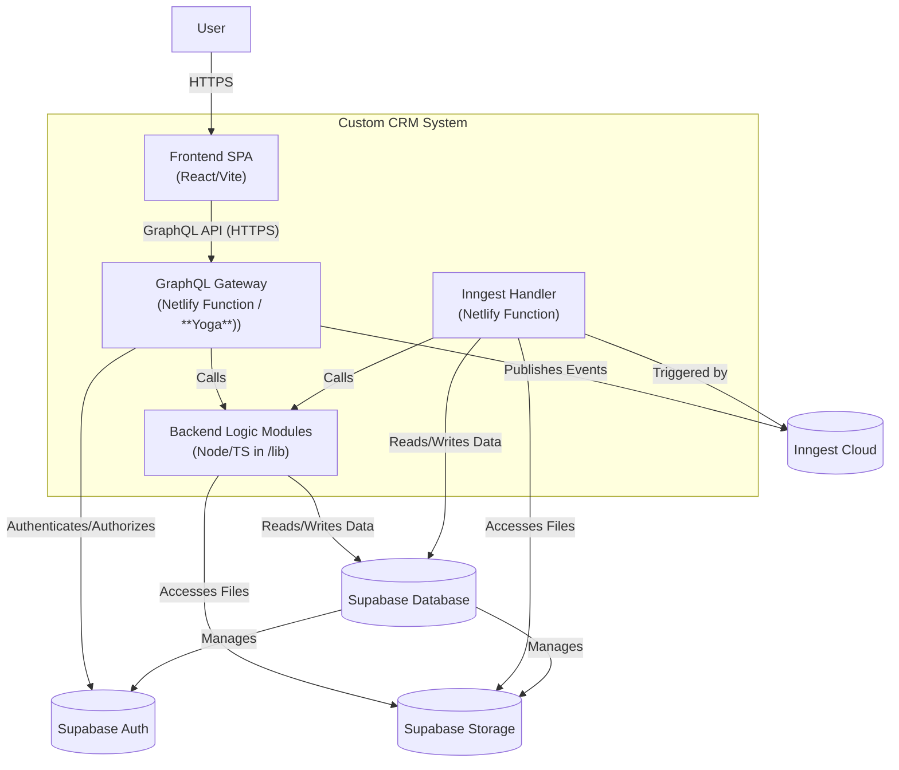
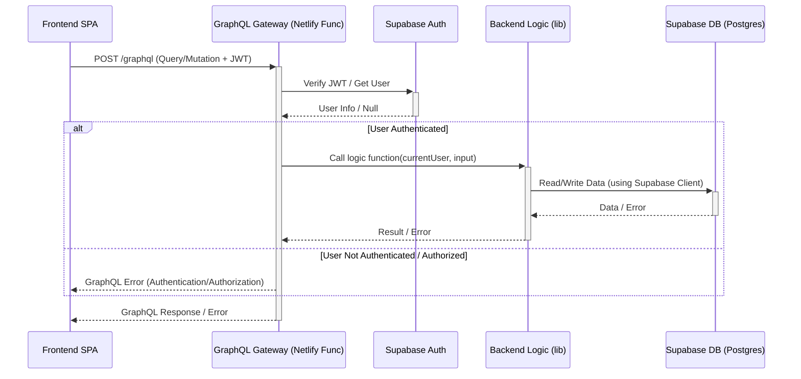
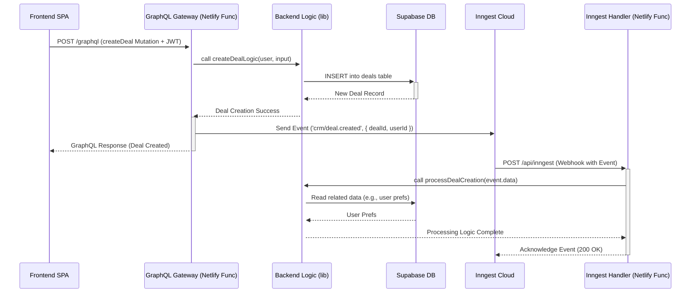

# Architecture Decision Record (ADR): Custom CRM System

**Status:** Proposed | **Date:** 2025-05-01 (Revised: 2025-05-26)

## 1. Context

This document outlines the architectural decisions for building a custom Customer Relationship Management (CRM) system intended to replace Pipedrive. The system aims to be scalable, maintainable, secure, and ready for future expansion into adjacent business domains (e.g., Accounting, Logistics), aligning with Domain-Driven Design (DDD) principles. **The initial implementation will focus on delivering a core Minimum Viable Product (MVP) feature set** before achieving full feature parity. This ADR reflects lessons learned from previous projects and incorporates feedback on simplifying the developer experience and mitigating common risks.

## 2. Goal

Build a custom CRM system leveraging a serverless architecture deployed on Netlify, with robust security, compliance, and scalability features, designed for future extensibility, starting with an MVP feature set.

## 3. Core Principles

1.  **Logically Decomposed Services:** Decompose functionality into independent backend logic modules (initially within a shared `/lib` structure, invoked by Netlify Functions) aligned with DDD principles, enabling easier addition of new business domains. Avoid premature optimization into many separate Netlify Functions beyond the core Gateway and Inngest handler.
2.  **GraphQL API Layer:** Utilize a central GraphQL Gateway (as a Netlify Function) to provide a unified, typed API for the frontend, simplifying data aggregation across domains. **Decision:** Use a custom gateway (**GraphQL Yoga**), **not** Supabase `pg_graphql` directly for the main API (See ADR-001).
3.  **Serverless First:** Leverage Netlify Functions (gateway, Inngest handler, potentially other future background tasks) and Supabase (database, auth, storage) to minimize infrastructure management.
4.  **Local First Development:** Prioritize efficient local development and testing using `netlify dev` and `supabase start`. Local credentials obtained via `supabase status`.
5.  **Clear Separation of Concerns:** Maintain boundaries between Frontend (UI - React/Vite), GraphQL Gateway (API - **GraphQL Yoga**), Backend Logic (Domain Logic - Node/TS modules in `/lib`), Database (Data Persistence - Supabase/Postgres), Authentication (Supabase Auth), and Asynchronous Tasks (Inngest).
6.  **Infrastructure as Code:** Define configurations in `netlify.toml` and manage schema via Supabase migrations (using Supabase CLI workflow).
7.  **Security by Default:** Implement authentication (Supabase JWT), authorization (Gateway checks + RLS), Row Level Security (default deny, specific grants), secure function defaults (`SECURITY INVOKER` where possible, controlled use of `service_role` or `SECURITY DEFINER` documented), rigorous input validation, and GraphQL security measures (depth/complexity limits, disable introspection in prod).
8.  **Leverage Managed Services:** Use managed services (Supabase, Netlify, Inngest) where appropriate, but plan for potential exit strategies (See Risks & ADR-003).
9.  **Data Integrity & Privacy:** Ensure data isolation and implement workflows for compliance (GDPR data erasure via Inngest, etc.).
10. **Automated Testing & Deployment:** Implement a **prioritized testing strategy** (focusing on integration tests for resolvers/handlers, critical unit tests, and core E2E flows for MVP) and leverage Netlify CI/CD. Expand coverage iteratively.
11. **Event-Driven Architecture:** Use asynchronous events (via Inngest - See ADR-003) for crucial cross-service/domain communication, decoupling, reliable background task execution (e.g., post-mutation workflows, data cleanup, compliance tasks), and future A2A communication.
12. **Stable Dependencies:** Prioritize latest stable versions (LTS Node, non-RC libraries) and verify compatibility.
13. **Future Extensibility:** Design architectural components (GraphQL schema, Backend Logic Modules, Events) to facilitate adding new features and business domains (See ADR-004).

## 4. Architecture Outline

*   **Frontend:** React SPA (built with Vite - See ADR-002), communicates via GraphQL. Hosted on Netlify CDN.
*   **API Layer:** GraphQL (**GraphQL Yoga** on Netlify Function) at `/graphql`. Authenticates requests (Supabase JWT), performs authorization checks, validates inputs, and orchestrates data fetching/mutations by calling backend logic modules or Supabase directly for simple cases.
*   **Backend Logic:** Domain-specific Node.js/TypeScript modules located **within a `/lib` directory** in the project structure. Contains business logic, complex validation, and database interactions. Invoked by GraphQL resolvers or Inngest handlers. (Future: May refactor into a `packages/` monorepo if complexity warrants).
*   **Database:** Supabase (PostgreSQL) with RLS enabled. Accessed primarily by backend logic modules via Supabase client library. Migrations managed via Supabase CLI.
*   **Authentication:** Supabase Auth. JWT passed from Frontend to Gateway via `Authorization` header.
*   **Asynchronous Workflows:** Inngest for event-driven, cross-service communication and background task processing (e.g., post-mutation workflows, data cleanup, GDPR erasure, future A2A communication bus - See ADR-003). Requires an Inngest handler Netlify Function (`/api/inngest`).
*   **File Storage:** Supabase Storage for user uploads, etc. Accessed via Supabase client library.
*   **Deployment:** Netlify handles frontend hosting, GraphQL Gateway function, Inngest handler function. CI/CD via Netlify Build/GitHub Actions. Secrets managed via Netlify environment variables (populated from `.env` locally, `.env` is gitignored).

**Diagrams:**

**(Diagrams remain the same as they accurately reflect the architecture including Frontend, Gateway, Logic (running within Function context), DB, Auth, Inngest, and Netlify)**

**C4 Model - Level 1: System Context**

**C4 Model - Level 2: Container Diagram**

**Sequence Diagram: Authenticated GraphQL Request** (Remains the same)

**Sequence Diagram: Async Event Workflow (e.g., Deal Creation)** (Remains the same)

**Future Expansion:** New domains (Accounting, etc.) added as backend logic modules/services (potentially transitioning to a `packages/` monorepo structure then), integrated into the GraphQL schema via the Gateway. Inngest handles async communication between domains.

### 4.1 Conceptual Service Decomposition (Domain Modules)

> **Purpose:** Provide a clear mapping between Pipedrive‑like business capabilities and our DDD‑aligned backend logic modules. During MVP, these will live in `/lib` as isolated folders (`/lib/deals`, `/lib/leads`, …). They may later graduate to separate services or packages.

|  #  | Domain Module (Conceptual Microservice) | Core Responsibilities                                | Initial MVP Scope                           |
| :-: | --------------------------------------- | ---------------------------------------------------- | ------------------------------------------- |
|  1  | **Lead Management**                     | Capture, store, qualify leads → promote to deals.    | ✅ *In* (basic lead inbox, convert to deal)  |
|  2  | **Deal Management**                     | Lifecycle of active deals, stage transitions, value. | ✅ *In* (CRUD implemented)                   |
|  3  | **Pipeline Management**                 | Define pipelines & stages; validate deal stage flow. | ✅ *In* (single default pipeline)            |
|  4  | **Contact Management**                  | People & Organizations, dedupe, search.              | ✅ *In* (basic CRUD)                         |
|  5  | **Activity Management**                 | Tasks, calls, meetings, reminders, calendar sync.    | ✅ *In* (tasks & reminders only)             |
|  6  | **Project (Post‑Sale) Management**      | Group deals into delivery projects & milestones.     | ⬜ *Later* (post‑MVP)                        |
|  7  | **Product Catalog & Pricing**           | Products, price books, line items on deals.          | ⬜ *Later* (post‑MVP)                        |
|  8  | **Email Communication**                 | Email sync/BCC, link threads to deals & contacts.    | ⬜ *Later* (phase 2)                         |
|  9  | **Workflow Automation**                 | Rule‑based triggers/actions across modules.          | ⬜ *Later* (phase 2)                         |
|  10 | **Reporting & Insights**                | Dashboards, metrics, goals, forecasts.               | ⬜ *Later* (phase 2)                         |
|  11 | **User Management**                     | Create/disable users, profile, team membership.      | ✅ *In* (basic user table via Supabase Auth) |
|  12 | **Role & Permission**                   | RBAC, record visibility, RLS policies.               | ✅ *In* (owner / company‑wide)               |
|  13 | **Integration Gateway**                 | Third‑party connectors, webhooks, API management.    | ⬜ *Later* (phase 2)                         |
|  14 | **Document Management**                 | Files, proposals, e‑signature, attachment storage.   | ⬜ *Later* (phase 2)                         |

*Legend: ✅ Included in MVP · ⬜ Deferred*

## 5. Key Technology Choices & Rationale

*   **Hosting & Serverless (Functions/Gateway): Netlify**
    *   **Rationale:** Integrated platform, simplifies deployment of frontend, gateway, and backend functions. Aligns with logical service decomposition. Reduces infrastructure overhead. Good developer experience with Netlify Dev.
*   **API Layer: GraphQL (GraphQL Yoga on Netlify Function)**
    *   **Rationale:** Flexible, typed API for frontend, simplifies cross-domain data aggregation. Reduces over/under-fetching. Provides necessary abstraction layer over the database for security and business logic. Lightweight and performant, suitable for serverless environments addressing cold start concerns proactively. Well-established ecosystem. (See ADR-001).
    *   **Alternatives Considered:**
        *   Supabase `pg_graphql`: **Rejected** for main API (see ADR-001 rationale).
        *   **Apollo Server**: Considered but **not chosen** as the primary due to potential cold start overhead compared to Yoga in a serverless context. Remains a viable alternative if advanced Apollo-specific features become essential.
        *   REST API: Rejected (see original ADR).
    *   **Cost Considerations:** GraphQL Yoga is open source.
*   **Identity & Access Management (IAM): Supabase Auth**
    *   **Rationale:** Managed, integrated with DB/RLS, good DX. JWT used for authenticating GraphQL requests.
*   **Database: Supabase (PostgreSQL)**
    *   **Rationale:** Managed Postgres with RLS, backups, extensions. Excellent DX. Migrations managed via Supabase CLI.
*   **Asynchronous Communication: Inngest** (See ADR-003)
    *   **Rationale:** Reliable event handling, scheduling, retries, observability for background tasks and cross-domain communication. Simplifies implementation of workflows like GDPR deletion, post-processing, and future integrations.
    *   **Risk Mitigation:** Abstract Inngest calls behind internal service interfaces. Define criteria and schedule periodic reviews for evaluating alternatives (e.g., `pg_cron` + worker, SQS+Lambda) based on cost, features, or lock-in concerns (See Risks/Roadmap/ADR-003).
*   **Frontend Framework: React + TypeScript + Vite** (See ADR-002)
    *   **Rationale:** Strong ecosystem, typing. Vite provides superior DX/performance over CRA.
*   **UI Component Library: Chakra UI**
    *   **Rationale:** Accelerates development, accessible, composable. (Future consideration for RSC remains).
*   **Dependency Versioning Strategy:** Use Node LTS. Use latest stable libraries, checking compatibility. Avoid RCs for critical dependencies.

## 6. Key Architectural Risks & Considerations

*   **GraphQL Gateway Cold Starts:** Serverless functions have cold starts. Using GraphQL Yoga helps mitigate this compared to heavier alternatives. **Mitigation:**
    *   Monitor p95 latency via Netlify/external monitoring. Set target (e.g., <500ms).
    *   Implement standard optimizations (reduce dependencies, efficient resolvers).
    *   If targets are still missed: 1) Investigate Netlify Function settings (memory), 2) Consider provisioned concurrency (cost).
*   **Serverless Limits:** Be mindful of Netlify Function execution time (10s default) and memory limits. **Mitigation:** Design efficiently. Offload *genuinely* long tasks to Inngest. Increase timeouts judiciously.
*   **GraphQL Security:** Potential for DoS via complex queries. **Mitigation:**
    *   **Mandatory:** Implement query depth limiting (e.g., `graphql-depth-limit`), query complexity analysis (e.g., `graphql-validation-complexity`), disable introspection in production.
    *   **Recommended:** Consider APQ or Operation Whitelisting later for enhanced security.
    *   **Process:** Rigorous input validation in resolvers/logic modules (e.g., using `zod`). Document patterns in `DEVELOPER_RUNBOOK.md`.
*   **Inngest Lock-in/Cost:** Dependency on a third-party SaaS. **Mitigation:**
    *   Monitor usage/cost.
    *   Abstract Inngest client calls.
    *   Execute scheduled re-evaluation of alternatives based on pre-defined criteria (See Roadmap/ADR-003).
*   **Compliance & Data Handling (GDPR/CCPA):** Requires specific workflows. **Mitigation:**
    *   Design, implement, and **test** the data erasure workflow using Inngest triggered by appropriate events (e.g., user deletion request, auth hook). Document the flow, including handling associated Storage objects.
    *   Implement RLS/authorization correctly.
    *   Confirm Supabase/Netlify region choices meet data residency requirements.
*   **Monorepo Build Times:** **Deferred Risk.** Starting with `/lib` simplifies initial builds. Re-evaluate if/when refactoring to a `packages/` monorepo structure; consider Nx/Turborepo at that time if build times (>10-15 mins) become problematic.
*   **Testing Complexity:** Ensuring adequate coverage requires effort. **Mitigation:** Implement a **prioritized testing strategy for MVP:** Focus on integration tests (GraphQL resolvers, Inngest handlers connecting to a test DB), unit tests for critical/complex logic in `/lib`, and core E2E tests (e.g., using Playwright/Cypress) for essential user flows. Automate in CI. Iteratively expand coverage post-MVP.

---
