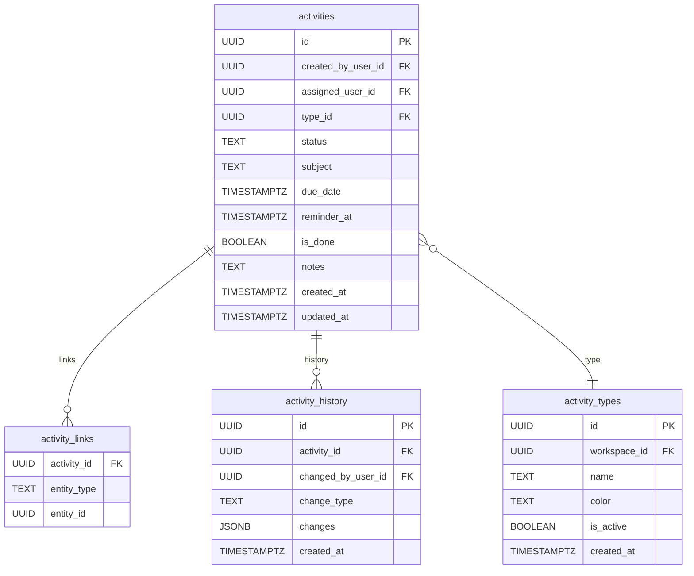

# Implementation Plan: Advanced Task & Activity Management

## Vision & Business Value

A best-in-class activity management system empowers users to create, assign, track, and complete tasks, calls, meetings, and other activities across multiple domains (sales, support, projects, etc.). It supports team collaboration, accountability, automation, and deep reporting, and is highly extensible for future needs.

**Key Business Benefits:**
- **Collaboration:** Assign, delegate, and share activities across teams and domains.
- **Accountability:** Every activity has a clear owner and status, with full audit history.
- **Productivity:** Users can focus on their assigned and relevant tasks, with reminders and notifications.
- **Automation:** Unlocks advanced workflow automations, round-robin assignment, and escalations.
- **Reporting:** Enables workload, performance, and SLA tracking by user, team, or domain.
- **Extensibility:** Supports new domains (support, projects, custom objects) and custom activity types.

---

## Features & Capabilities

- **Assignment & Delegation:** Assign activities to any user, reassign as needed, and filter by assignee.
- **Flexible Linking:** Link activities to multiple entities of any type (deals, people, tickets, projects, etc.) via a generic linking table.
- **Configurable Types:** Define custom activity types per workspace/domain (e.g., onboarding, bug fix, support call).
- **Rich Status:** Activities have a flexible status field (open, in_progress, done, blocked, cancelled, etc.), not just a boolean.
- **Reminders & Notifications:** Set reminders, receive notifications for assignments, due dates, and overdue activities.
- **Audit Trail:** Full audit/history table for all changes to activities (who changed what, when).
- **Advanced Filtering & Views:** Filter and sort by assignee, type, status, due date, linked entity, etc.
- **Automation Integration:** Activities can be created, updated, and reassigned by workflow automations, with support for escalations and cross-domain triggers.
- **Extensibility:** Designed for use across multiple domains, with per-domain configuration and cross-domain automation.
- **Testing & Risk Mitigation:** Emphasis on validation, permissions, and robust testing at every phase.

---

## System Architecture & Data Model

### Core Tables

- **activities**: The central table for all tasks, calls, meetings, etc. across all domains.
  - Key fields: `id`, `created_by_user_id`, `assigned_user_id`, `type_id`, `status`, `subject`, `due_date`, `reminder_at`, `is_done`, `notes`, `created_at`, `updated_at`
- **activity_types**: Configurable types per workspace/domain (e.g., call, meeting, bug fix).
- **activity_links**: Generic many-to-many linking table to associate activities with any entity (deal, person, ticket, project, etc.).
- **activity_history**: Audit trail for all changes to activities (who, what, when).

### How It Works

- **All activities/tasks for all domains are stored in the `activities` table.**
- **Linking to other entities** (deals, people, tickets, etc.) is handled via `activity_links`.
- **Assignment** is managed via `assigned_user_id` (can be reassigned at any time).
- **Types and statuses** are flexible and configurable.
- **Audit/history** is automatically recorded for every change.
- **Reminders and notifications** are scheduled and triggered by backend services.

### Services & API

- **Activity services** provide CRUD, filtering, assignment, status transitions, reminders, and history.
- **Filtering and querying** by assignee, creator, type, status, due date, linked entity, etc.
- **Frontend** interacts with these services for all forms, lists, detail views, and notifications.
- **Extensibility**: Adding new domains or types does not require schema changes—just new records in `activity_types` or new entity types in `activity_links`.

### Simple ERD (Entity Relationship Diagram)



### Phase Support Table

| Phase         | Supported by Core Tables/Services? | Notes                                                      |
|---------------|:----------------------------------:|------------------------------------------------------------|
| Phase 1       | Yes                                | Core schema, types, links, and history                     |
| Phase 2       | Yes                                | API/services for all CRUD, filtering, assignment, etc.     |
| Phase 3       | Yes                                | UI, notifications, reminders, history, advanced filtering  |
| Phase 4+      | Mostly (plus automation logic)     | May need more for automation triggers, escalations, etc.   |

---

## Example Use Cases
- Assign a follow-up call to a sales rep when a new deal is created.
- Delegate a support ticket to a specialist, with escalation if overdue.
- Automatically reassign overdue activities to a manager.
- Filter the activity list to "assigned to me", "created by me", "open", or "blocked".
- Link a task to multiple entities (deal, person, project).
- Add custom activity types (e.g., onboarding, bug fix) per workspace.
- Receive reminders and notifications for upcoming or overdue activities.
- View a full audit trail of changes to each activity.

---

## Implementation Roadmap

### Phase 1: Backend Foundation & Database Changes

#### 0: Mental Validation & Dry Run
* **Action:** Before writing code or running migrations, mentally walk through the changes, validate assumptions, and update the plan if new risks are found.

#### 1.1: Database Migration
* **Action 1.1.1:** Add/Update core activity table with advanced fields.
    * **Migration:** `supabase migrations new advanced_activity_management`
    * **SQL Definition:**
      ```sql
      -- Main activities table
      CREATE TABLE IF NOT EXISTS public.activities (
        id UUID PRIMARY KEY DEFAULT gen_random_uuid(),
        created_by_user_id UUID REFERENCES auth.users(id) ON DELETE SET NULL,
        assigned_user_id UUID REFERENCES auth.users(id) ON DELETE SET NULL,
        type_id UUID REFERENCES public.activity_types(id),
        status TEXT NOT NULL DEFAULT 'open', -- open, in_progress, done, blocked, cancelled, etc.
        subject TEXT NOT NULL,
        due_date TIMESTAMPTZ,
        reminder_at TIMESTAMPTZ,
        is_done BOOLEAN GENERATED ALWAYS AS (status = 'done') STORED,
        notes TEXT,
        created_at TIMESTAMPTZ NOT NULL DEFAULT now(),
        updated_at TIMESTAMPTZ NOT NULL DEFAULT now()
      );
      CREATE INDEX idx_activities_assigned_user_id ON public.activities(assigned_user_id);
      CREATE INDEX idx_activities_status ON public.activities(status);
      CREATE INDEX idx_activities_due_date ON public.activities(due_date);

      -- Activity types (configurable per workspace/domain)
      CREATE TABLE IF NOT EXISTS public.activity_types (
        id UUID PRIMARY KEY DEFAULT gen_random_uuid(),
        workspace_id UUID REFERENCES public.workspaces(id) ON DELETE CASCADE,
        name TEXT NOT NULL,
        color TEXT,
        is_active BOOLEAN DEFAULT TRUE,
        created_at TIMESTAMPTZ NOT NULL DEFAULT now()
      );
      CREATE INDEX idx_activity_types_workspace_id ON public.activity_types(workspace_id);

      -- Generic linking table for multi-entity support
      CREATE TABLE IF NOT EXISTS public.activity_links (
        activity_id UUID REFERENCES public.activities(id) ON DELETE CASCADE,
        entity_type TEXT NOT NULL, -- e.g., 'deal', 'person', 'organization', 'ticket', 'project'
        entity_id UUID NOT NULL,
        PRIMARY KEY (activity_id, entity_type, entity_id)
      );
      CREATE INDEX idx_activity_links_entity ON public.activity_links(entity_type, entity_id);

      -- Activity audit/history table
      CREATE TABLE IF NOT EXISTS public.activity_history (
        id UUID PRIMARY KEY DEFAULT gen_random_uuid(),
        activity_id UUID REFERENCES public.activities(id) ON DELETE CASCADE,
        changed_by_user_id UUID REFERENCES auth.users(id) ON DELETE SET NULL,
        change_type TEXT NOT NULL, -- created, updated, status_changed, reassigned, etc.
        changes JSONB,
        created_at TIMESTAMPTZ NOT NULL DEFAULT now()
      );
      CREATE INDEX idx_activity_history_activity_id ON public.activity_history(activity_id);
      ```
    * **Status:** Not Started

* **Action 1.1.2:** Update RLS policies for all new tables to support assignment, collaboration, and privacy.
    * **Status:** Not Started

* **Action 1.1.3:** Apply migration and verify changes.
    * **Status:** Not Started

#### 1.1R: Risk Mitigation for Database
* Migration verification checklist (no empty files, correct RLS, rollback scripts).
* Ensure all new fields are nullable or have safe defaults for backward compatibility.
* Test filtering and performance with new indexes and linking.

---

### Phase 2: Backend/API Updates

#### 0: Mental Validation & Dry Run
* **Action:** Before updating API logic, mentally simulate advanced flows (multi-linking, reassignment, status transitions, reminders, etc.).

#### 2.1: Update Activity Service/Resolvers
* **Action 2.1.1:** Update activity creation and update logic to support:
    - Assignment and reassignment (`assigned_user_id`)
    - Configurable types (`type_id`)
    - Rich status transitions
    - Multi-entity linking (via `activity_links`)
    - Reminders and notifications
    - Audit/history recording
    * **Status:** Not Started

* **Action 2.1.2:** Update queries to allow filtering by:
    - Assignee, creator, type, status, due date, linked entity, etc.
    * **Status:** Not Started

* **Action 2.1.3:** Update GraphQL types and input objects to include all new fields and relationships.
    * **Status:** Not Started

* **Action 2.1.4:** Ensure activity queries return all relevant details (assigned user, type, status, links, history, etc.).
    * **Status:** Not Started

#### 2.1R: Risk Mitigation for API
* Validate all foreign keys and references.
* Handle cases where users, types, or linked entities are deleted.
* Ensure only authorized users can assign/reassign, edit, or view activities.
* Enforce status transition rules.

---

### Phase 3: Frontend Updates

#### 0: Mental Validation & Dry Run
* **Action:** Before UI changes, mentally simulate advanced user journeys (assignment, multi-linking, status changes, reminders, etc.).

#### 3.1: Activity Creation/Edit Forms
* **Action 3.1.1:** Add selectors for:
    - Assignee (user dropdown/autocomplete)
    - Type (configurable per workspace/domain)
    - Status (with allowed transitions)
    - Linked entities (multi-select, generic)
    - Reminder date/time
    * **Status:** Not Started

* **Action 3.1.2:** On activity creation/edit, allow full configuration of all fields.
    * **Status:** Not Started

#### 3.2: Activity List, Filtering & Views
* **Action 3.2.1:** Display all key fields (assignee, type, status, due date, reminders, links, etc.).
    * **Status:** Not Started

* **Action 3.2.2:** Add advanced filtering and sorting (by assignee, type, status, due, linked entity, etc.).
    * **Status:** Not Started

* **Action 3.2.3:** Show activity history/audit trail in detail view.
    * **Status:** Not Started

#### 3.3: Notifications & Reminders
* **Action 3.3.1:** Notify users of assignments, reminders, status changes, and overdue activities (email, in-app, etc.).
    * **Status:** Not Started

#### 3R: Risk Mitigation for Frontend
* Validate all user input and selections.
* Handle deleted/inactive users, types, or linked entities gracefully.
* Ensure UI clearly distinguishes between assigned, unassigned, and reassigned activities.
* Test all advanced flows and edge cases.

---

### Phase 4: Automation & Extensibility

#### 0: Mental Validation & Dry Run
* **Action:** Before enabling automations or domain-specific features, mentally simulate advanced flows (cross-domain linking, escalations, etc.).

#### 4.1: Automation Engine
* **Action 4.1.1:** Update workflow automation logic to:
    - Assign activities to users or teams based on rules
    - Set type, status, reminders, and links
    - Support escalations, round-robin, and cross-domain triggers
    * **Status:** Not Started

* **Action 4.1.2:** Allow automations to create, update, and reassign activities across domains.
    * **Status:** Not Started

#### 4.2: Extensibility for New Domains
* **Action 4.2.1:** Support linking activities to custom objects (tickets, projects, etc.) via `activity_links`.
    * **Status:** Not Started

* **Action 4.2.2:** Allow per-domain or per-workspace configuration of activity types and statuses.
    * **Status:** Not Started

#### 4R: Risk Mitigation for Automation & Extensibility
* Validate all references and rules.
* Handle assignment and linking failures gracefully.
* Ensure automations respect permissions and business logic.

---

## Implementation Checklist & Timeline

### Phase 1: Backend (Estimated: 2 weeks)
- [ ] **Mental Validation & Dry Run**
- [ ] Database migration (activities, types, links, history)
- [ ] RLS policy update
- [ ] Migration verification

### Phase 2: API (Estimated: 2 weeks)
- [ ] **Mental Validation & Dry Run**
- [ ] Service/resolver updates
- [ ] GraphQL type updates
- [ ] Filtering & querying support
- [ ] Testing

### Phase 3: Frontend (Estimated: 2 weeks)
- [ ] **Mental Validation & Dry Run**
- [ ] Form updates (assignment, type, status, links, reminders)
- [ ] List/detail/history updates
- [ ] Filtering UI
- [ ] Notification/reminder UI
- [ ] Testing

### Phase 4: Automation & Extensibility (Estimated: 2+ weeks)
- [ ] **Mental Validation & Dry Run**
- [ ] Automation logic update
- [ ] Cross-domain support
- [ ] Testing

---

**This plan provides a robust, extensible roadmap for implementing advanced task/activity management, enabling best-in-class collaboration, automation, and reporting across multiple domains.** 