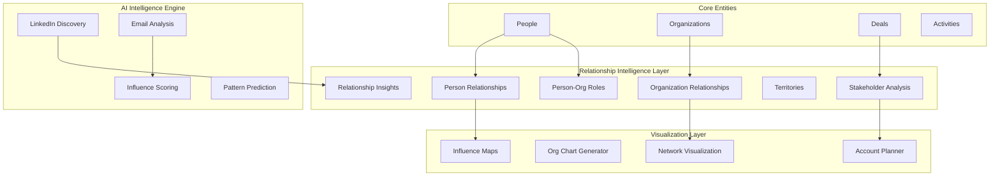

# Relationship Intelligence Platform - Architecture & Implementation Plan

**Document Version:** 1.0  
**Date:** 2025-01-04  
**Status:** Planning Phase  

## 1. Executive Summary

This document outlines the architecture and implementation plan for transforming PipeCD into a **Relationship Intelligence Platform**. Based on analysis of sophisticated sales pipeline visualizations used by enterprise sales teams, we've identified critical gaps in relationship mapping, stakeholder analysis, and organizational network intelligence.

### Key Objectives:
- Transform flat CRM data into dynamic relationship networks
- Enable AI-powered stakeholder influence analysis  
- Provide automated account planning and relationship discovery
- Deliver mind-blowing visualization capabilities for sales teams
- Build predictive intelligence for deal progression

---

## 2. Current State Analysis

### What We Have:
✅ **Basic Entities**: Deals, People, Organizations, Activities, Leads  
✅ **AI Agent**: 30+ tools for CRM automation  
✅ **Custom Fields**: Democratized field creation  
✅ **WFM Integration**: Workflow management for processes  

### What We're Missing:
❌ **Organizational Hierarchies**: Parent-child company relationships  
❌ **Person Relationships**: Reports-to, influences, collaborates-with  
❌ **Cross-Org Role Mapping**: Matrix organizations, multiple roles  
❌ **Stakeholder Analysis**: Decision authority, influence scoring  
❌ **Relationship Visualization**: Network diagrams, influence maps  
❌ **Predictive Intelligence**: Deal path analysis, risk assessment  

---

## 3. Target Architecture

### 3.1 Relationship Intelligence Data Layer



### 3.2 Technology Stack

**Backend:**
- **Database**: PostgreSQL + Supabase (existing)
- **API Layer**: GraphQL (existing) + New Relationship resolvers
- **AI Engine**: Claude 4 Sonnet (existing) + Relationship analysis tools
- **Data Processing**: Node.js background jobs + Inngest

**Frontend:**
- **UI Framework**: React + Chakra UI (existing)
- **Visualization**: D3.js + React-D3-Graph + Cytoscape.js
- **State Management**: Zustand (existing)
- **Charts**: Recharts + Custom network components

**External Integrations:**
- **LinkedIn API**: For organizational discovery
- **Email Analysis**: For relationship pattern detection
- **Graph Databases**: Neo4j (future consideration for complex queries)

---

## 4. Data Model Architecture

### 4.1 Core Relationship Tables

#### Organization Relationships
```sql
CREATE TABLE organization_relationships (
    id UUID PRIMARY KEY DEFAULT gen_random_uuid(),
    parent_org_id UUID NOT NULL REFERENCES organizations(id) ON DELETE CASCADE,
    child_org_id UUID NOT NULL REFERENCES organizations(id) ON DELETE CASCADE,
    relationship_type TEXT NOT NULL CHECK (relationship_type IN (
        'subsidiary', 'division', 'partnership', 'supplier', 'customer', 
        'joint_venture', 'acquisition_target', 'competitor'
    )),
    ownership_percentage DECIMAL(5,2), -- 0.00 to 100.00
    relationship_strength INTEGER CHECK (relationship_strength BETWEEN 1 AND 10),
    start_date DATE,
    end_date DATE,
    notes TEXT,
    metadata JSONB,
    created_at TIMESTAMPTZ DEFAULT NOW(),
    updated_at TIMESTAMPTZ DEFAULT NOW(),
    created_by_user_id UUID REFERENCES user_profiles(user_id),
    
    -- Prevent self-referencing and duplicate relationships
    CONSTRAINT no_self_reference CHECK (parent_org_id != child_org_id),
    CONSTRAINT unique_org_relationship UNIQUE (parent_org_id, child_org_id, relationship_type)
);
```

#### Person Relationships
```sql
CREATE TABLE person_relationships (
    id UUID PRIMARY KEY DEFAULT gen_random_uuid(),
    from_person_id UUID NOT NULL REFERENCES people(id) ON DELETE CASCADE,
    to_person_id UUID NOT NULL REFERENCES people(id) ON DELETE CASCADE,
    relationship_type TEXT NOT NULL CHECK (relationship_type IN (
        'reports_to', 'manages', 'influences', 'collaborates_with', 
        'mentors', 'partners_with', 'competes_with', 'refers_to'
    )),
    relationship_strength INTEGER CHECK (relationship_strength BETWEEN 1 AND 10),
    is_bidirectional BOOLEAN DEFAULT FALSE,
    interaction_frequency TEXT CHECK (interaction_frequency IN (
        'daily', 'weekly', 'monthly', 'quarterly', 'annually', 'rarely'
    )),
    relationship_context TEXT, -- 'work', 'personal', 'industry', 'education'
    notes TEXT,
    metadata JSONB,
    created_at TIMESTAMPTZ DEFAULT NOW(),
    updated_at TIMESTAMPTZ DEFAULT NOW(),
    created_by_user_id UUID REFERENCES user_profiles(user_id),
    
    -- Prevent self-referencing
    CONSTRAINT no_self_reference CHECK (from_person_id != to_person_id),
    CONSTRAINT unique_person_relationship UNIQUE (from_person_id, to_person_id, relationship_type)
);
```

#### Person Organizational Roles
```sql
CREATE TABLE person_organizational_roles (
    id UUID PRIMARY KEY DEFAULT gen_random_uuid(),
    person_id UUID NOT NULL REFERENCES people(id) ON DELETE CASCADE,
    organization_id UUID NOT NULL REFERENCES organizations(id) ON DELETE CASCADE,
    role_title TEXT NOT NULL,
    department TEXT,
    seniority_level TEXT CHECK (seniority_level IN (
        'entry', 'mid', 'senior', 'lead', 'manager', 'director', 'vp', 'c_level', 'founder'
    )),
    is_primary_role BOOLEAN DEFAULT TRUE,
    start_date DATE,
    end_date DATE,
    reporting_structure JSONB, -- {manager_id, direct_reports: [], dotted_line_reports: []}
    responsibilities JSONB, -- Array of responsibility areas
    budget_authority_usd DECIMAL(15,2),
    team_size INTEGER,
    notes TEXT,
    created_at TIMESTAMPTZ DEFAULT NOW(),
    updated_at TIMESTAMPTZ DEFAULT NOW(),
    created_by_user_id UUID REFERENCES user_profiles(user_id)
);
```

#### Stakeholder Analysis
```sql
CREATE TABLE stakeholder_analysis (
    id UUID PRIMARY KEY DEFAULT gen_random_uuid(),
    person_id UUID NOT NULL REFERENCES people(id) ON DELETE CASCADE,
    deal_id UUID REFERENCES deals(id) ON DELETE CASCADE,
    lead_id UUID REFERENCES leads(id) ON DELETE CASCADE,
    organization_id UUID NOT NULL REFERENCES organizations(id) ON DELETE CASCADE,
    
    -- Influence & Decision Power
    influence_score INTEGER CHECK (influence_score BETWEEN 1 AND 10),
    decision_authority TEXT CHECK (decision_authority IN (
        'final_decision', 'strong_influence', 'recommender', 'influencer', 'gatekeeper', 'end_user', 'blocker'
    )),
    budget_authority_level TEXT CHECK (budget_authority_level IN (
        'unlimited', 'high', 'medium', 'low', 'none'
    )),
    
    -- Engagement Analysis
    engagement_level TEXT CHECK (engagement_level IN (
        'champion', 'supporter', 'neutral', 'skeptic', 'blocker'
    )),
    communication_preference TEXT CHECK (communication_preference IN (
        'email', 'phone', 'in_person', 'slack', 'teams', 'formal_meetings'
    )),
    preferred_meeting_time TEXT,
    
    -- Business Context
    pain_points JSONB, -- Array of pain point categories
    motivations JSONB, -- What drives their decisions
    success_metrics JSONB, -- How they measure success
    concerns JSONB, -- What worries them about solutions
    
    -- Relationship Strategy
    approach_strategy TEXT,
    next_best_action TEXT,
    last_interaction_date DATE,
    last_interaction_type TEXT,
    
    -- AI Insights
    ai_personality_profile JSONB,
    ai_communication_style TEXT,
    ai_decision_pattern TEXT,
    ai_influence_network JSONB,
    
    created_at TIMESTAMPTZ DEFAULT NOW(),
    updated_at TIMESTAMPTZ DEFAULT NOW(),
    created_by_user_id UUID REFERENCES user_profiles(user_id),
    
    -- Ensure we have either deal_id or lead_id, not both
    CONSTRAINT stakeholder_context CHECK (
        (deal_id IS NOT NULL AND lead_id IS NULL) OR 
        (deal_id IS NULL AND lead_id IS NOT NULL) OR
        (deal_id IS NULL AND lead_id IS NULL)
    )
);
```

#### Territories
```sql
CREATE TABLE territories (
    id UUID PRIMARY KEY DEFAULT gen_random_uuid(),
    name TEXT NOT NULL,
    territory_type TEXT CHECK (territory_type IN (
        'geographic', 'industry', 'account_size', 'product_line', 'hybrid'
    )),
    region TEXT,
    country TEXT,
    state_province TEXT,
    city TEXT,
    industry_focus TEXT[],
    account_size_range TEXT, -- 'enterprise', 'mid_market', 'smb'
    parent_territory_id UUID REFERENCES territories(id),
    assigned_user_id UUID REFERENCES user_profiles(user_id),
    is_active BOOLEAN DEFAULT TRUE,
    metadata JSONB,
    created_at TIMESTAMPTZ DEFAULT NOW(),
    updated_at TIMESTAMPTZ DEFAULT NOW()
);

CREATE TABLE account_territories (
    organization_id UUID REFERENCES organizations(id) ON DELETE CASCADE,
    territory_id UUID REFERENCES territories(id) ON DELETE CASCADE,
    is_primary BOOLEAN DEFAULT TRUE,
    assignment_reason TEXT,
    created_at TIMESTAMPTZ DEFAULT NOW(),
    PRIMARY KEY (organization_id, territory_id)
);
```

#### Relationship Insights (AI-Generated)
```sql
CREATE TABLE relationship_insights (
    id UUID PRIMARY KEY DEFAULT gen_random_uuid(),
    insight_type TEXT NOT NULL CHECK (insight_type IN (
        'missing_stakeholder', 'relationship_gap', 'influence_pattern', 
        'decision_path', 'risk_alert', 'opportunity', 'relationship_strength_change'
    )),
    entity_type TEXT NOT NULL CHECK (entity_type IN ('deal', 'lead', 'organization', 'person')),
    entity_id UUID NOT NULL,
    priority_level TEXT CHECK (priority_level IN ('critical', 'high', 'medium', 'low')),
    
    insight_title TEXT NOT NULL,
    insight_description TEXT NOT NULL,
    recommended_actions JSONB, -- Array of suggested actions
    confidence_score DECIMAL(3,2), -- 0.00 to 1.00
    
    supporting_data JSONB, -- Data that led to this insight
    ai_reasoning TEXT, -- AI explanation of how it reached this conclusion
    
    status TEXT DEFAULT 'new' CHECK (status IN ('new', 'reviewed', 'acting_on', 'completed', 'dismissed')),
    reviewed_by_user_id UUID REFERENCES user_profiles(user_id),
    reviewed_at TIMESTAMPTZ,
    
    expires_at TIMESTAMPTZ, -- Some insights may be time-sensitive
    created_at TIMESTAMPTZ DEFAULT NOW(),
    updated_at TIMESTAMPTZ DEFAULT NOW()
);
```

### 4.2 Indexes for Performance

```sql
-- Organization relationships
CREATE INDEX idx_org_rel_parent ON organization_relationships(parent_org_id);
CREATE INDEX idx_org_rel_child ON organization_relationships(child_org_id);
CREATE INDEX idx_org_rel_type ON organization_relationships(relationship_type);

-- Person relationships  
CREATE INDEX idx_person_rel_from ON person_relationships(from_person_id);
CREATE INDEX idx_person_rel_to ON person_relationships(to_person_id);
CREATE INDEX idx_person_rel_type ON person_relationships(relationship_type);

-- Person organizational roles
CREATE INDEX idx_person_org_roles_person ON person_organizational_roles(person_id);
CREATE INDEX idx_person_org_roles_org ON person_organizational_roles(organization_id);
CREATE INDEX idx_person_org_roles_primary ON person_organizational_roles(is_primary_role);

-- Stakeholder analysis
CREATE INDEX idx_stakeholder_person ON stakeholder_analysis(person_id);
CREATE INDEX idx_stakeholder_deal ON stakeholder_analysis(deal_id);
CREATE INDEX idx_stakeholder_influence ON stakeholder_analysis(influence_score);

-- Relationship insights
CREATE INDEX idx_insights_entity ON relationship_insights(entity_type, entity_id);
CREATE INDEX idx_insights_priority ON relationship_insights(priority_level);
CREATE INDEX idx_insights_status ON relationship_insights(status);
```

---

## 5. Implementation Phases

### Phase 1: Foundation (Weeks 1-4)
**Goal**: Core relationship data model and basic CRUD operations

#### Database Schema
- [ ] Create all relationship tables with proper constraints
- [ ] Add RLS policies for data security
- [ ] Create performance indexes
- [ ] Add audit triggers for change tracking

#### GraphQL API Extensions
- [ ] New resolvers for organization relationships
- [ ] Person relationship CRUD operations
- [ ] Stakeholder analysis mutations and queries
- [ ] Territory management operations

#### Basic UI Components
- [ ] Relationship creation forms
- [ ] Simple relationship lists and tables
- [ ] Basic stakeholder profile views
- [ ] Territory assignment interface

#### AI Agent Integration
- [ ] New tools for relationship creation
- [ ] Stakeholder analysis AI tools
- [ ] Relationship discovery prompts
- [ ] Basic relationship insights generation

### Phase 2: Intelligence Engine (Weeks 5-8)
**Goal**: AI-powered relationship discovery and analysis

#### LinkedIn Integration
- [ ] LinkedIn API setup and authentication
- [ ] Organization chart discovery from LinkedIn
- [ ] Person profile enrichment
- [ ] Relationship inference from LinkedIn connections

#### Email Analysis Engine
- [ ] Email signature parsing for org charts
- [ ] Communication pattern analysis
- [ ] Relationship strength scoring from email frequency
- [ ] Meeting attendance influence analysis

#### AI Relationship Intelligence
- [ ] Stakeholder influence scoring algorithms
- [ ] Decision pattern recognition from historical data
- [ ] Missing stakeholder identification
- [ ] Relationship gap analysis

#### Enhanced AI Agent Tools
- [ ] "Analyze stakeholder network" tool
- [ ] "Find missing influencers" tool  
- [ ] "Predict deal path" tool
- [ ] "Score relationship strength" tool

### Phase 3: Visualization Engine (Weeks 9-12)
**Goal**: Interactive relationship mapping and org chart visualization

#### Network Visualization Components
- [ ] D3.js-based org chart renderer
- [ ] Interactive stakeholder influence maps
- [ ] Deal flow visualization through org hierarchy
- [ ] Relationship strength heat maps

#### Advanced UI Features
- [ ] Drag-and-drop org chart builder
- [ ] Real-time relationship updates
- [ ] Collaborative stakeholder mapping
- [ ] Mobile-responsive relationship views

#### Integration Features
- [ ] Export org charts to PDF/PNG
- [ ] Integration with presentation tools
- [ ] Relationship data import/export
- [ ] API for third-party visualization tools

### Phase 4: Predictive Intelligence (Weeks 13-16)
**Goal**: Advanced relationship analytics and deal intelligence

#### Predictive Analytics
- [ ] Deal progression prediction based on stakeholder engagement
- [ ] Champion departure risk alerts
- [ ] Optimal engagement sequence recommendations
- [ ] Competitive threat analysis from relationship patterns

#### Advanced AI Features
- [ ] Relationship-aware deal coaching
- [ ] Stakeholder personality profiling
- [ ] Communication style adaptation recommendations
- [ ] Account expansion opportunity identification

#### Enterprise Features
- [ ] Team relationship sharing and collaboration
- [ ] Relationship handoff workflows
- [ ] Advanced permission models for sensitive relationships
- [ ] Relationship ROI tracking and analytics

---

## 6. AI Agent Tools Expansion

### New Relationship Intelligence Tools

#### Core Relationship Tools
1. **`create_organization_relationship`**
   - Map parent-child company relationships
   - Set ownership percentages and relationship types
   - Auto-detect subsidiaries from public data

2. **`create_person_relationship`**
   - Map reporting structures and influences
   - Set relationship strength and context
   - Import from LinkedIn connections

3. **`analyze_stakeholder_network`**
   - Generate stakeholder influence maps
   - Identify decision makers and influencers
   - Highlight relationship gaps

4. **`map_decision_process`**
   - Trace decision-making paths through org hierarchy
   - Identify required approvals and influences
   - Predict deal progression bottlenecks

#### Advanced Analysis Tools
5. **`find_missing_stakeholders`**
   - Identify key people missing from deal process
   - Suggest important roles not yet engaged
   - Recommend relationship building priorities

6. **`score_relationship_strength`**
   - Analyze communication patterns and frequency
   - Score relationship health and influence
   - Predict relationship stability

7. **`predict_deal_path`**
   - Map likely decision process based on org structure
   - Identify critical path stakeholders
   - Estimate decision timeline

8. **`analyze_competitive_position`**
   - Map competitor relationships within account
   - Identify competitive threats and advantages
   - Suggest competitive strategies

#### Discovery and Enrichment Tools
9. **`discover_linkedin_network`**
   - Auto-discover org charts from LinkedIn
   - Enrich person profiles with LinkedIn data
   - Map relationship networks

10. **`analyze_email_patterns`**
    - Extract relationship insights from email metadata
    - Identify communication hierarchies
    - Score influence from CC patterns and response times

---

## 7. User Experience Design

### 7.1 Core User Journeys

#### Sales Rep Journey: "Account Planning"
1. **Context**: Preparing for a major enterprise deal
2. **Process**: 
   - Upload organization chart or let AI discover it
   - Map stakeholders to deal stages
   - Identify relationship gaps and get AI recommendations
   - Build relationship engagement strategy
3. **Outcome**: Clear stakeholder engagement plan with priorities

#### Sales Manager Journey: "Team Relationship Oversight"
1. **Context**: Managing team's account relationships
2. **Process**:
   - View team relationship coverage across accounts
   - Identify at-risk relationships (single-threaded deals)
   - Reassign relationships when reps leave
   - Track relationship ROI and engagement
3. **Outcome**: Optimized team relationship coverage

#### C-Level Journey: "Strategic Account Intelligence"
1. **Context**: Understanding relationships across major accounts
2. **Process**:
   - View relationship network across multiple deals
   - Identify cross-selling opportunities through relationships
   - Analyze competitive positioning
   - Strategic relationship investment decisions
3. **Outcome**: Data-driven relationship strategy

### 7.2 Key Interface Components

#### Organization Relationship Map
```typescript
interface OrgMapProps {
  organizationId: string;
  viewMode: 'hierarchy' | 'network' | 'influence';
  interactionMode: 'view' | 'edit' | 'collaborate';
  stakeholderFilter?: StakeholderFilter;
  dealContext?: string; // Filter for specific deal
}
```

#### Stakeholder Influence Dashboard
```typescript
interface StakeholderDashboardProps {
  dealId?: string;
  organizationId: string;
  viewType: 'influence_map' | 'decision_tree' | 'engagement_timeline';
  aiInsights: boolean;
  collaborativeMode: boolean;
}
```

#### Relationship Intelligence Panel
```typescript
interface RelationshipIntelligenceProps {
  entityType: 'deal' | 'organization' | 'person';
  entityId: string;
  insightTypes: ('gaps' | 'risks' | 'opportunities' | 'predictions')[];
  autoRefresh: boolean;
}
```

---

## 8. Technical Integration Points

### 8.1 AI Agent Integration

#### Tool Registration
```typescript
// lib/aiAgent/tools/domains/RelationshipModule.ts
export class RelationshipModule {
  async analyzeStakeholderNetwork(params: StakeholderAnalysisParams, context: ToolExecutionContext) {
    // Fetch all relationships for organization
    // Calculate influence scores
    // Generate network analysis
    // Return insights and recommendations
  }
  
  async findMissingStakeholders(params: StakeholderGapParams, context: ToolExecutionContext) {
    // Analyze org chart completeness
    // Compare with industry standards
    // Identify critical missing roles
    // Suggest relationship building actions
  }
}
```

#### GraphQL Schema Extensions
```graphql
type OrganizationRelationship {
  id: ID!
  parentOrganization: Organization!
  childOrganization: Organization!
  relationshipType: OrgRelationshipType!
  ownershipPercentage: Float
  relationshipStrength: Int
  startDate: Date
  endDate: Date
  notes: String
  metadata: JSON
}

type PersonRelationship {
  id: ID!
  fromPerson: Person!
  toPerson: Person!
  relationshipType: PersonRelationshipType!
  relationshipStrength: Int
  isBidirectional: Boolean
  interactionFrequency: InteractionFrequency
  relationshipContext: String
  notes: String
}

type StakeholderAnalysis {
  id: ID!
  person: Person!
  deal: Deal
  lead: Lead
  organization: Organization!
  influenceScore: Int
  decisionAuthority: DecisionAuthority!
  budgetAuthorityLevel: BudgetAuthorityLevel!
  engagementLevel: EngagementLevel!
  painPoints: [String!]!
  motivations: [String!]!
  approachStrategy: String
  aiPersonalityProfile: JSON
  aiCommunicationStyle: String
}

type RelationshipInsight {
  id: ID!
  insightType: InsightType!
  entityType: EntityType!
  entityId: ID!
  priorityLevel: PriorityLevel!
  insightTitle: String!
  insightDescription: String!
  recommendedActions: [String!]!
  confidenceScore: Float!
  supportingData: JSON
  aiReasoning: String
  status: InsightStatus!
}
```

### 8.2 Background Job Processing

#### Relationship Discovery Jobs
```typescript
// lib/aiAgent/jobs/relationshipDiscovery.ts
export const discoverLinkedInRelationships = inngest.createFunction(
  { id: "discover-linkedin-relationships" },
  { event: "relationship/discover.linkedin" },
  async ({ event, step }) => {
    const { organizationId, personId } = event.data;
    
    // Step 1: Fetch LinkedIn organization data
    const orgData = await step.run("fetch-linkedin-org", async () => {
      return await linkedInService.getOrganizationChart(organizationId);
    });
    
    // Step 2: Create missing relationships
    const relationships = await step.run("create-relationships", async () => {
      return await relationshipService.createFromLinkedInData(orgData);
    });
    
    // Step 3: Generate insights
    await step.run("generate-insights", async () => {
      return await relationshipIntelligence.analyzeNewRelationships(relationships);
    });
  }
);
```

#### Stakeholder Analysis Jobs
```typescript
export const analyzeStakeholderInfluence = inngest.createFunction(
  { id: "analyze-stakeholder-influence" },
  { event: "stakeholder/analyze.influence" },
  async ({ event, step }) => {
    const { dealId, organizationId } = event.data;
    
    // Analyze email patterns, meeting frequency, decision patterns
    // Update influence scores
    // Generate insights and recommendations
  }
);
```

---

## 9. Success Metrics & KPIs

### Development Metrics
- **Phase 1**: Core relationship model implemented (100% table coverage)
- **Phase 2**: AI discovery accuracy >85% for LinkedIn relationships
- **Phase 3**: Visualization performance <2s load time for 100+ node networks
- **Phase 4**: Prediction accuracy >75% for deal progression

### Business Metrics
- **Deal Velocity**: 25% faster deal cycles through better stakeholder mapping
- **Win Rate**: 15% improvement through relationship intelligence
- **Account Expansion**: 30% increase in cross-sell success through relationship mapping
- **Relationship Coverage**: >90% of deals have mapped stakeholder networks

### User Adoption Metrics
- **Feature Usage**: >70% of active deals have stakeholder analysis
- **Time to Value**: <30 minutes to map stakeholder network for new deal
- **User Satisfaction**: >4.5/5 rating for relationship features
- **ROI**: 3x ROI through improved deal efficiency and win rates

---

## 10. Risk Assessment & Mitigation

### Technical Risks
**Risk**: Complex relationship queries may impact database performance  
**Mitigation**: Implement graph database layer (Neo4j) for complex relationship queries

**Risk**: LinkedIn API rate limits and access restrictions  
**Mitigation**: Implement progressive data discovery, respect rate limits, multiple data sources

**Risk**: Visualization performance with large relationship networks  
**Mitigation**: Virtual scrolling, progressive loading, network clustering algorithms

### Business Risks
**Risk**: User complexity - relationship mapping may be too complex for basic users  
**Mitigation**: AI-first approach, auto-discovery, guided onboarding, progressive disclosure

**Risk**: Data privacy concerns with relationship intelligence  
**Mitigation**: Granular permissions, anonymization options, compliance frameworks

**Risk**: Integration complexity with existing sales processes  
**Mitigation**: Phased rollout, change management support, existing workflow integration

### Data Risks
**Risk**: Inaccurate relationship data leading to poor decisions  
**Mitigation**: Confidence scoring, multiple data source verification, user feedback loops

**Risk**: Relationship data becoming stale  
**Mitigation**: Automated refresh workflows, activity-based relationship updates, decay algorithms

---

## 11. Future Enhancements

### Advanced AI Capabilities
- **Natural Language Queries**: "Show me all decision makers for this deal"
- **Predictive Relationship Modeling**: Forecast relationship changes
- **Automated Relationship Maintenance**: AI-suggested relationship nurturing
- **Cross-Platform Integration**: Slack, Teams, calendar relationship inference

### Enterprise Features
- **Multi-Tenant Relationship Sharing**: Cross-company relationship intelligence
- **Relationship Marketplaces**: Verified relationship introductions
- **Competitive Intelligence**: Industry relationship benchmarking
- **Relationship ROI Analytics**: Quantify relationship investment returns

### Integration Ecosystem
- **CRM Migrations**: Import relationship data from Salesforce, HubSpot
- **Social Platforms**: Twitter, Facebook relationship discovery
- **Communication Tools**: Email, calendar, meeting relationship inference
- **Data Providers**: Enrich with ZoomInfo, Apollo, LinkedIn Sales Navigator

---

## 12. Conclusion

The Relationship Intelligence Platform represents a fundamental evolution of PipeCD from a traditional CRM to an AI-powered relationship intelligence system. By implementing sophisticated relationship mapping, stakeholder analysis, and predictive intelligence, we can deliver the "mind-blowing" automated features that transform how sales teams understand and navigate complex organizational networks.

This implementation plan provides a structured approach to building enterprise-grade relationship intelligence while maintaining the innovative AI-first approach that differentiates PipeCD in the market.

**Next Steps:**
1. Review and approve architecture design
2. Set up development environment for Phase 1
3. Begin database schema implementation
4. Parallel development of AI tools and UI components
5. Continuous testing with real sales scenarios

The future of sales is relationship intelligence - and PipeCD is positioned to lead this transformation. 