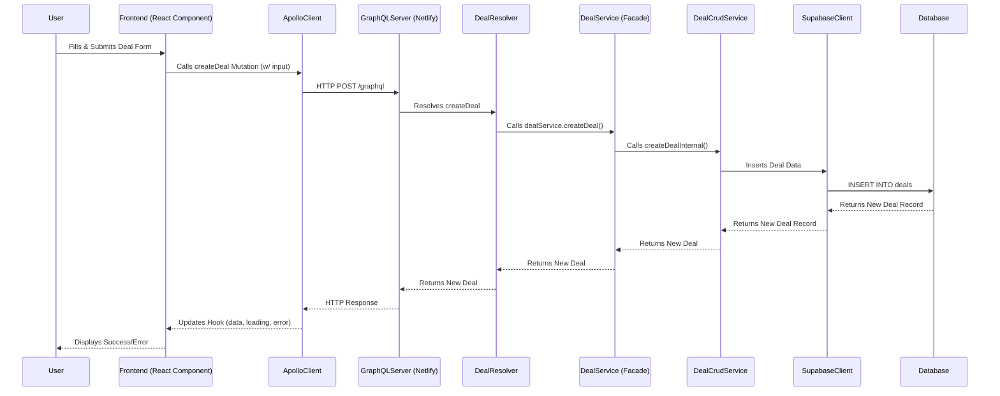
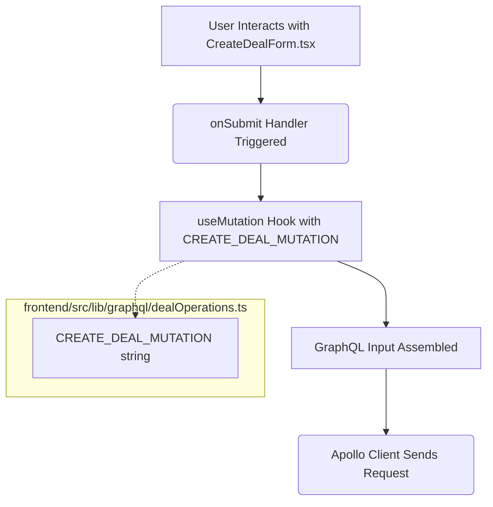
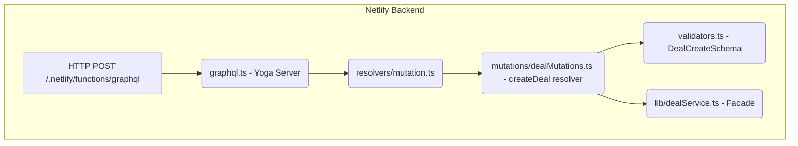
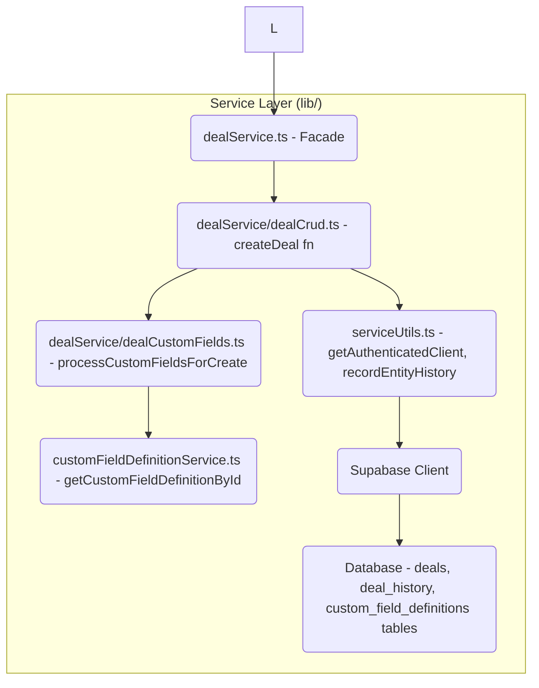

# Create New Deal: End-to-End Flow

**ID:** DOC-FLOW-001
**Author:** AI Assistant
**Date:** {{YYYY-MM-DD}} <!-- Will be replaced by current date -->

**Goal:** This document outlines the step-by-step process of creating a new deal within the application, from frontend user interaction to backend data persistence and response.

## Overview

Creating a new deal involves several layers of the application:

1.  **Frontend (React):** User interface for form input, GraphQL mutation call via Apollo Client.
2.  **Backend (Netlify GraphQL Server):** Receives the request, validates input, and orchestrates business logic.
3.  **Service Layer (Business Logic):** Handles core deal creation logic, custom fields, probability (if applicable on create), and history.
4.  **Database (Supabase/PostgreSQL):** Persists the new deal data.

## Sequence Diagram (High-Level)



## Detailed File Interaction Flow

### Phase 1: Frontend (React Application)

1.  **User Interaction & Form Submission**
    *   **File:** `frontend/src/components/deals/CreateDealForm.tsx` (Likely)
    *   **Action:** User fills form, triggers `onSubmit` handler.
    *   `useMutation` hook (Apollo Client) is prepared with `CREATE_DEAL_MUTATION`.
    *   Form data is transformed into GraphQL `CreateDealInput`.

2.  **GraphQL Mutation Definition (Frontend)**
    *   **File:** `frontend/src/lib/graphql/dealOperations.ts`
    *   **Action:** Contains the `CREATE_DEAL_MUTATION` string.
    ```graphql
    mutation CreateDeal($input: CreateDealInput!) {
      createDeal(input: $input) {
        id
        name
        // ... other fields
      }
    }
    ```



### Phase 2: GraphQL Request to Backend

*   **Action:** Apollo Client sends an HTTP POST request to `/.netlify/functions/graphql`.

### Phase 3: Backend (Netlify Function - GraphQL Server)

1.  **GraphQL Server Entry Point**
    *   **File:** `netlify/functions/graphql.ts`
    *   **Action:** Yoga server receives request, authenticates, parses, identifies `createDeal` mutation.

2.  **Mutation Resolver Orchestration**
    *   **File:** `netlify/functions/graphql/resolvers/mutation.ts`
    *   **Action:** Delegates to `dealMutations`.
    ```typescript
    // ... imports ...
    import { dealMutations } from './mutations/dealMutations';
    export const Mutation = { ...dealMutations, /* ... */ };
    ```

3.  **`createDeal` Resolver Execution**
    *   **File:** `netlify/functions/graphql/resolvers/mutations/dealMutations.ts`
    *   **Action:** `createDeal` resolver function:
        *   Validates input via Zod schema from `netlify/functions/graphql/validators.ts` (`DealCreateSchema`).
        *   Calls `dealService.createDeal()`.
        *   May trigger Inngest event (`lib/inngestClient.ts`).



### Phase 4: Service Layer (Business Logic)

1.  **`dealService` Facade**
    *   **File:** `lib/dealService.ts`
    *   **Action:** `createDeal` method calls `createDealInternal` from `lib/dealService/dealCrud.ts`.

2.  **Core `createDeal` Logic**
    *   **File:** `lib/dealService/dealCrud.ts`
    *   **Action:** `createDeal` function:
        *   Gets authenticated Supabase client (via `lib/serviceUtils.ts`).
        *   Calls `processCustomFieldsForCreate` (from `lib/dealService/dealCustomFields.ts`).
        *   Inserts data into `deals` table via Supabase client.
        *   Calls `recordEntityHistory` (from `lib/serviceUtils.ts`).

3.  **Custom Field Processing**
    *   **File:** `lib/dealService/dealCustomFields.ts`
    *   **Action:** `processCustomFieldsForCreate` function:
        *   Calls `getCustomFieldDefinitionById` (from `lib/customFieldDefinitionService.ts`).

4.  **Database Interaction & History**
    *   Supabase client (from `lib/supabaseClient.ts` and `lib/serviceUtils.ts`) interacts with PostgreSQL.
    *   RLS policies in `supabase/migrations/` are enforced.
    *   `deal_history` table is updated by `recordEntityHistory`.



### Phase 5: Response Propagation

*   **Action:** The newly created deal data flows back from `dealCrud.ts` -> `dealService.ts` (Facade) -> `dealMutations.ts` (Resolver) -> `graphql.ts` (Yoga Server) -> Apollo Client -> Frontend Component.

## Key Files Involved Summary

*   **Frontend UI & Logic:** `frontend/src/components/deals/CreateDealForm.tsx` (or similar)
*   **Frontend GraphQL Ops:** `frontend/src/lib/graphql/dealOperations.ts`
*   **GraphQL Server Entry:** `netlify/functions/graphql.ts`
*   **Main Mutation Resolver:** `netlify/functions/graphql/resolvers/mutation.ts`
*   **Deal Specific Resolvers:** `netlify/functions/graphql/resolvers/mutations/dealMutations.ts`
*   **Input Validators:** `netlify/functions/graphql/validators.ts`
*   **Deal Service Facade:** `lib/dealService.ts`
*   **Core Deal Logic:** `lib/dealService/dealCrud.ts`
*   **Custom Field Logic (Deals):** `lib/dealService/dealCustomFields.ts`
*   **Custom Field Definitions Service:** `lib/customFieldDefinitionService.ts`
*   **Shared Service Utilities:** `lib/serviceUtils.ts` (authentication, history)
*   **Supabase Client Init:** `lib/supabaseClient.ts`
*   **Inngest Client Init:** `lib/inngestClient.ts` (if events are sent)
*   **Database Migrations/RLS:** `supabase/migrations/`

This document provides a traceable path for the "Create New Deal" feature. Further details for each function can be found within the respective files. 