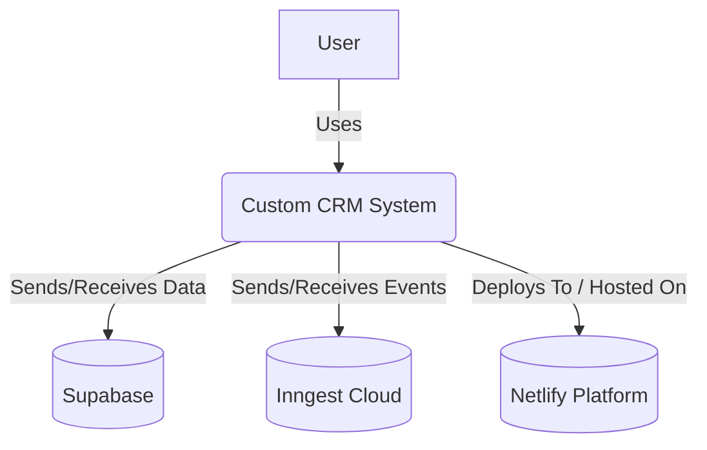
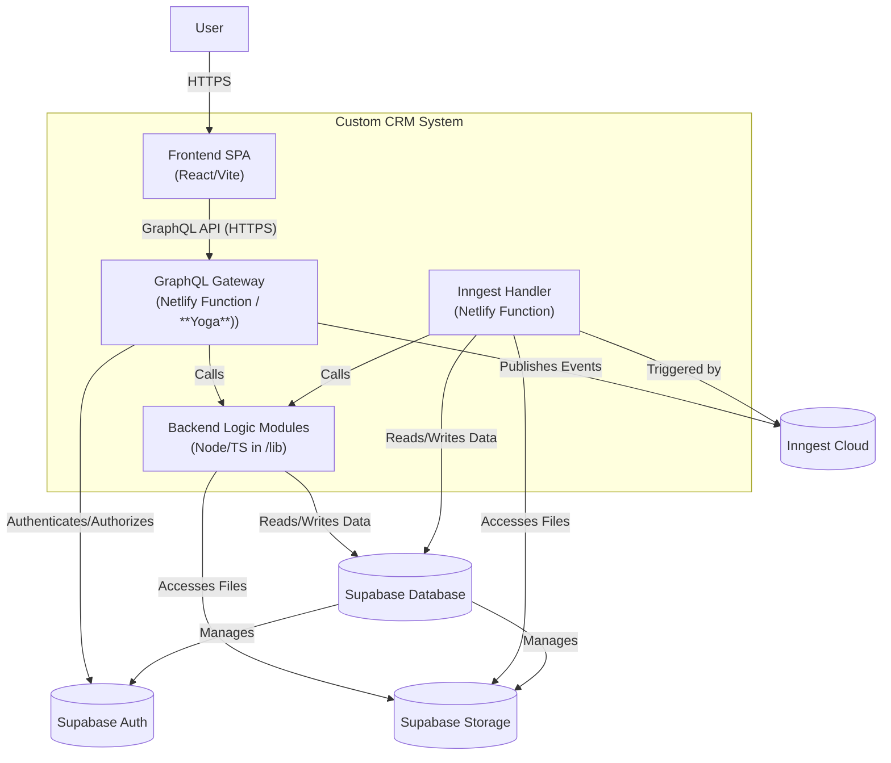
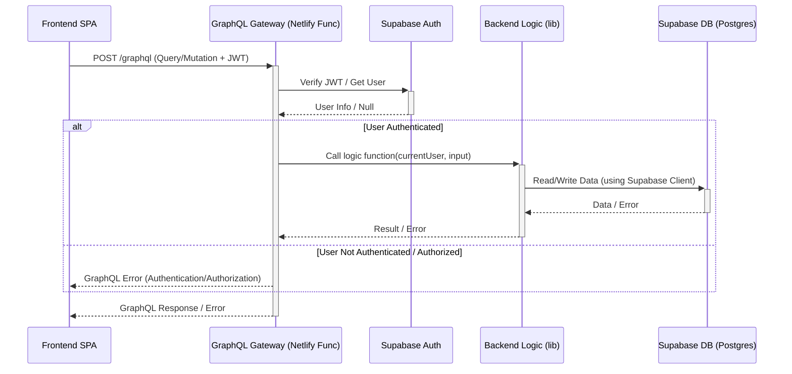
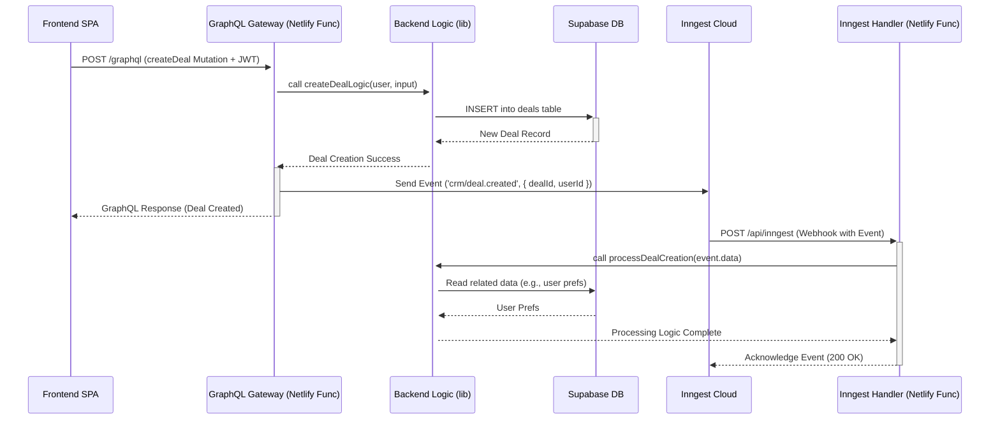

# Architecture Decision Record (ADR): Custom CRM System

**Status:** Proposed | **Date:** 2025-05-01 (Revised: 2025-05-26)

## 1. Context

This document outlines the architectural decisions for building a custom Customer Relationship Management (CRM) system intended to replace Pipedrive. The system aims to be scalable, maintainable, secure, and ready for future expansion into adjacent business domains (e.g., Accounting, Logistics), aligning with Domain-Driven Design (DDD) principles. **The initial implementation will focus on delivering a core Minimum Viable Product (MVP) feature set** before achieving full feature parity. This ADR reflects lessons learned from previous projects and incorporates feedback on simplifying the developer experience and mitigating common risks.

## 2. Goal

Build a custom CRM system leveraging a serverless architecture deployed on Netlify, with robust security, compliance, and scalability features, designed for future extensibility, starting with an MVP feature set.

## 3. Core Principles

1.  **Logically Decomposed Services:** Decompose functionality into independent backend logic modules (initially within a shared `/lib` structure, invoked by Netlify Functions) aligned with DDD principles, enabling easier addition of new business domains. Avoid premature optimization into many separate Netlify Functions beyond the core Gateway and Inngest handler.
2.  **GraphQL API Layer:** Utilize a central GraphQL Gateway (as a Netlify Function) to provide a unified, typed API for the frontend, simplifying data aggregation across domains. **Decision:** Use a custom gateway (**GraphQL Yoga**), **not** Supabase `pg_graphql` directly for the main API (See ADR-001).
3.  **Serverless First:** Leverage Netlify Functions (gateway, Inngest handler, potentially other future background tasks) and Supabase (database, auth, storage) to minimize infrastructure management.
4.  **Local First Development:** Prioritize efficient local development and testing using `netlify dev` and `supabase start`. Local credentials obtained via `supabase status`.
5.  **Clear Separation of Concerns:** Maintain boundaries between Frontend (UI - React/Vite), GraphQL Gateway (API - **GraphQL Yoga**), Backend Logic (Domain Logic - Node/TS modules in `/lib`), Database (Data Persistence - Supabase/Postgres), Authentication (Supabase Auth), and Asynchronous Tasks (Inngest).
6.  **Infrastructure as Code:** Define configurations in `netlify.toml` and manage schema via Supabase migrations (using Supabase CLI workflow).
7.  **Security by Default:** Implement authentication (Supabase JWT), authorization (Gateway checks + RLS), Row Level Security (default deny, specific grants), secure function defaults (`SECURITY INVOKER` where possible, controlled use of `service_role` or `SECURITY DEFINER` documented), rigorous input validation, and GraphQL security measures (depth/complexity limits, disable introspection in prod).
8.  **Leverage Managed Services:** Use managed services (Supabase, Netlify, Inngest) where appropriate, but plan for potential exit strategies (See Risks & ADR-003).
9.  **Data Integrity & Privacy:** Ensure data isolation and implement workflows for compliance (GDPR data erasure via Inngest, etc.).
10. **Automated Testing & Deployment:** Implement a **prioritized testing strategy** (using Vitest for unit/integration tests, focusing on resolvers/handlers and critical logic; plus core E2E flows for MVP) and leverage Netlify CI/CD. Expand coverage iteratively.
11. **Event-Driven Architecture:** Use asynchronous events (via Inngest - See ADR-003) for crucial cross-service/domain communication, decoupling, reliable background task execution (e.g., post-mutation workflows, data cleanup, compliance tasks), and future A2A communication.
12. **Stable Dependencies:** Prioritize latest stable versions (LTS Node, non-RC libraries) and verify compatibility.
13. **Future Extensibility:** Design architectural components (GraphQL schema, Backend Logic Modules, Events) to facilitate adding new features and business domains (See ADR-004).

## 4. Architecture Outline

*   **Frontend:** React SPA (built with Vite - See ADR-002), communicates via GraphQL. Hosted on Netlify CDN.
*   **API Layer:** GraphQL (**GraphQL Yoga** on Netlify Function) at `/graphql`. Authenticates requests (Supabase JWT), performs authorization checks, validates inputs, and orchestrates data fetching/mutations by calling backend logic modules or Supabase directly for simple cases.
*   **Backend Logic:** Domain-specific Node.js/TypeScript modules located **within a `/lib` directory** in the project structure. Contains business logic, complex validation, and database interactions. Invoked by GraphQL resolvers or Inngest handlers. (Future: May refactor into a `packages/` monorepo if complexity warrants).
*   **Database:** Supabase (PostgreSQL) with RLS enabled. Accessed primarily by backend logic modules via Supabase client library. Migrations managed via Supabase CLI.
*   **Authentication:** Supabase Auth. JWT passed from Frontend to Gateway via `Authorization` header.
*   **Asynchronous Workflows:** Inngest for event-driven, cross-service communication and background task processing (e.g., post-mutation workflows, data cleanup, GDPR erasure, future A2A communication bus - See ADR-003). Requires an Inngest handler Netlify Function (`/api/inngest`).
*   **File Storage:** Supabase Storage for user uploads, etc. Accessed via Supabase client library.
*   **Deployment:** Netlify handles frontend hosting, GraphQL Gateway function, Inngest handler function. CI/CD via Netlify Build/GitHub Actions. Secrets managed via Netlify environment variables (populated from `.env` locally, `.env` is gitignored).

**Diagrams:**

**(Diagrams remain the same as they accurately reflect the architecture including Frontend, Gateway, Logic (running within Function context), DB, Auth, Inngest, and Netlify)**

**C4 Model - Level 1: System Context**

**C4 Model - Level 2: Container Diagram**

**Sequence Diagram: Authenticated GraphQL Request** (Remains the same)

**Sequence Diagram: Async Event Workflow (e.g., Deal Creation)** (Remains the same)

**Future Expansion:** New domains (Accounting, etc.) added as backend logic modules/services (potentially transitioning to a `packages/` monorepo structure then), integrated into the GraphQL schema via the Gateway. Inngest handles async communication between domains.

### 4.1 Conceptual Service Decomposition (Domain Modules)

> **Purpose:** Provide a clear mapping between Pipedrive‑like business capabilities and our DDD‑aligned backend logic modules. During MVP, these will live in `/lib` as isolated folders (`/lib/deals`, `/lib/leads`, …). They may later graduate to separate services or packages.

|  #  | Domain Module (Conceptual Microservice) | Core Responsibilities                                | Initial MVP Scope                           | Status / Notes                                       |
| :-: | --------------------------------------- | ---------------------------------------------------- | ------------------------------------------- | ---------------------------------------------------- |
|  1  | **Lead Management**                     | Capture, store, qualify leads → promote to deals.    | ✅ *In* (basic lead inbox, convert to deal)  | ⬜ *Later* (Requires dedicated implementation)        |
|  2  | **Deal Management**                     | Lifecycle of active deals, stage transitions, value. | ✅ *In* (CRUD implemented)                   | ✅ Done (Core CRUD)                                  |
|  3  | **Pipeline Management**                 | Define pipelines & stages; validate deal stage flow. | ✅ *In* (single default pipeline)            | 🟡 *In Progress* (Schema/Service implemented)        |
|  4  | **Contact Management**                  | People & Organizations, dedupe, search.              | ✅ *In* (basic CRUD)                         | ✅ Done (Person/Org CRUD)                             |
|  5  | **Activity Management**                 | Tasks, calls, meetings, reminders, calendar sync.    | ✅ *In* (tasks & reminders only)             | ⬜ *Later* (Requires significant expansion)         |
|  6  | **Project (Post-Sale) Management**      | Group deals into delivery projects & milestones.     | ⬜ *Later* (post-MVP)                        | ⬜ Not Started                                       |
|  7  | **Product Catalog & Pricing**           | Products, price books, line items on deals.          | ⬜ *Later* (post-MVP)                        | ⬜ Not Started                                       |
|  8  | **Email Communication**                 | Email sync/BCC, link threads to deals & contacts.    | ⬜ *Later* (phase 2)                         | ⬜ Not Started                                       |
|  9  | **Workflow Automation**                 | Rule-based triggers/actions across modules.          | ⬜ *Later* (phase 2)                         | ⬜ Not Started                                       |
|  10 | **Reporting & Insights**                | Dashboards, metrics, goals, forecasts.               | ⬜ *Later* (phase 2)                         | ⬜ Not Started                                       |
|  11 | **User Management**                     | Create/disable users, profile, team membership.      | ✅ *In* (Supabase Auth + `user_profiles` table) | ✅ Done (Profile view/edit for display name & avatar implemented) |
|  12 | **Role & Permission**                   | RBAC, record visibility, RLS policies.               | ✅ *In* (owner / company-wide)               | ✅ *In* (Basic RLS via `auth.uid()`), ⬜ *Later* (RBAC) |
|  13 | **Integration Gateway**                 | Third-party connectors, webhooks, API management.    | ⬜ *Later* (phase 2)                         | ⬜ Not Started                                       |
|  14 | **Document Management**                 | Files, proposals, e-signature, attachment storage.   | ⬜ *Later* (phase 2)                         | ⬜ Not Started                                       |

*Legend: ✅ Implemented (Basic/Core) · 🟡 In Progress/Enhancing · ⬜ Deferred/Not Started*

*Note:* Contact Management (People/Organizations) is now implemented. Pipeline/Stage schema and basic service logic are implemented.

## 5. Key Technology Choices & Rationale

*   **Hosting & Serverless (Functions/Gateway): Netlify**
    *   **Rationale:** Integrated platform, simplifies deployment of frontend, gateway, and backend functions. Aligns with logical service decomposition. Reduces infrastructure overhead. Good developer experience with Netlify Dev.
*   **API Layer: GraphQL (GraphQL Yoga on Netlify Function)**
    *   **Rationale:** Flexible, typed API for frontend, simplifies cross-domain data aggregation. Reduces over/under-fetching. Provides necessary abstraction layer over the database for security and business logic. Lightweight and performant, suitable for serverless environments addressing cold start concerns proactively. Well-established ecosystem. (See ADR-001).
    *   **Alternatives Considered:**
        *   Supabase `pg_graphql`: **Rejected** for main API (see ADR-001 rationale).
        *   **Apollo Server**: Considered but **not chosen** as the primary due to potential cold start overhead compared to Yoga in a serverless context. Remains a viable alternative if advanced Apollo-specific features become essential.
        *   REST API: Rejected (see original ADR).
    *   **Cost Considerations:** GraphQL Yoga is open source.
*   **Identity & Access Management (IAM): Supabase Auth**
    *   **Rationale:** Managed, integrated with DB/RLS, good DX. JWT used for authenticating GraphQL requests.
*   **Database: Supabase (PostgreSQL)**
    *   **Rationale:** Managed Postgres with RLS, backups, extensions. Excellent DX. Migrations managed via Supabase CLI.
*   **Asynchronous Communication: Inngest** (See ADR-003)
    *   **Rationale:** Reliable event handling, scheduling, retries, observability for background tasks and cross-domain communication. Simplifies implementation of workflows like GDPR deletion, post-processing, and future integrations.
    *   **Risk Mitigation:** Abstract Inngest calls behind internal service interfaces. Define criteria and schedule periodic reviews for evaluating alternatives (e.g., `pg_cron` + worker, SQS+Lambda) based on cost, features, or lock-in concerns (See Risks/Roadmap/ADR-003).
*   **Frontend Framework: React + TypeScript + Vite** (See ADR-002)
    *   **Rationale:** Strong ecosystem, typing. Vite provides superior DX/performance over CRA.
*   **UI Component Library: Chakra UI**
    *   **Rationale:** Accelerates development, accessible, composable. (Future consideration for RSC remains).
*   **Frontend State Management: Zustand**
    *   **Rationale:** Chosen for its simplicity, minimal boilerplate, and good performance characteristics for managing global state (like authentication) and server cache state (like fetched data lists) in the React frontend. Alternatives like Redux Toolkit or Jotai were considered but Zustand offered the best balance for the current project scale.
*   **Dependency Versioning Strategy:** Use Node LTS. Use latest stable libraries, checking compatibility. Avoid RCs for critical dependencies.
*   **Deletion Strategy for Linked Entities (e.g., Person linked to Deal):**
    *   **Context:** Entities like Persons can be linked to other entities like Deals (via `deals.person_id`). Deleting a primary entity (Person) requires a strategy for handling references in associated entities (Deals).
    *   **Decision (Current - MVP):** Implement hard deletes for primary entities. Utilize database foreign key constraints with `ON DELETE SET NULL` for references where appropriate (e.g., on `deals.person_id` referencing `persons.id`). When a Person is deleted, the database automatically sets `person_id` to `NULL` on associated Deals.
    *   **Rationale:** This approach prioritizes simplicity for the initial implementation. It ensures referential integrity at the database level and clearly reflects the deletion in the UI (the Deal appears unlinked). It avoids the complexity of soft-delete flags or deletion prevention logic during the MVP phase.
    *   **Future Considerations:** If business requirements evolve to necessitate preserving historical links after deletion, revisit this decision. Alternatives include:
        *   **Soft Deletes:** Add `is_deleted`/`deleted_at` flags to entities like `persons`, requiring query modifications (`WHERE deleted_at IS NULL`) and potentially more complex UI handling.
        *   **Deletion Prevention:** Block deletion of entities if they are actively linked elsewhere, requiring user intervention to unlink first.
*   **Process:** Rigorous input validation in resolvers/logic modules (e.g., using `zod`). Document patterns in `DEVELOPER_GUIDE.md`.
*   **Inngest Lock-in/Cost:** Dependency on a third-party SaaS. **Mitigation:**
    *   Monitor usage/cost.
    *   Abstract Inngest client calls.
*   **Testing Complexity:** Ensuring adequate coverage requires effort. **Mitigation:** Implement a **prioritized testing strategy for MVP:** Use Vitest for integration tests (GraphQL resolvers, Inngest handlers connecting to a test DB or mocked services) and unit tests (critical/complex logic in `/lib`). Add core E2E tests (e.g., using Playwright/Cypress) for essential user flows. Automate selected tests in CI. Iteratively expand coverage post-MVP.

*   **Frontend GraphQL Type Generation: GraphQL Code Generator**
    *   **Rationale:** To enhance developer experience, ensure type safety, and reduce boilerplate when working with GraphQL in the frontend, `graphql-codegen` has been adopted. It generates TypeScript types directly from the GraphQL schema and frontend operations.
    *   **Benefits:**
        *   Strongly typed GraphQL operations (queries, mutations) and their results, primarily consumed via `useAppStore.ts` actions and state.
        *   Reduced likelihood of runtime errors due to type mismatches between frontend and backend schema.
        *   Faster development as types are automatically generated and updated, ensuring consistency between the GraphQL schema, store logic, and UI components.
    *   **Implementation:** Configured via `frontend/codegen.ts` (or `codegen.yml`), uses the `client-preset` (or similar plugins like `typescript`, `typescript-operations`, `typescript-graphql-request`), and generates types into `frontend/src/generated/graphql/`. Core entity types (e.g., `Deal`, `Person`) and input types (e.g., `DealInput`) are then re-exported from `frontend/src/stores/useAppStore.ts`, which serves as the primary source for UI components to import these types. Store actions in `useAppStore.ts` are also typed using these generated types for their parameters and return values. See `DEVELOPER_GUIDE.md` for detailed usage patterns.

*   **Deletion Strategy for Linked Pipeline/Stage Entities:**
    *   **Context:** Entities like Pipelines contain Stages, and Stages can be linked to Deals (via `deals.stage_id`). Deleting a Pipeline or a Stage requires a strategy for handling these relationships to maintain data integrity and prevent application errors.
    *   **Problem Observed:** Deleting a Pipeline (which might cascade to delete its Stages) that has Stages linked to Deals can lead to orphaned `deals.stage_id` values if not handled correctly. This can cause GraphQL queries for Deals to fail with an internal server error when trying to resolve a non-existent Stage.
    *   **Decision (Current - MVP):**
        1.  **Pipelines to Stages:** When a `Pipeline` is deleted, all its associated `Stage` records will also be deleted (achieved via `ON DELETE CASCADE` on the `stages.pipeline_id` foreign key).
        2.  **Stages to Deals:** When a `Stage` is deleted (either directly or as a result of a Pipeline deletion), any `Deal` referencing that `Stage` will have its `deals.stage_id` foreign key automatically set to `NULL` (achieved via `ON DELETE SET NULL` on the `deals.stage_id` foreign key).
    *   **Rationale:** This approach ensures data integrity at the database level, preventing orphaned foreign keys and subsequent application errors. It allows for the deletion of pipelines and stages even if they are in use, with deals gracefully becoming "stageless." The frontend should then be able to handle and display deals with a `null` stage appropriately (e.g., showing "N/A" or omitting stage information).
    *   **Implementation:** Requires database migrations to set up the appropriate `ON DELETE CASCADE` and `ON DELETE SET NULL` behaviors on the relevant foreign keys.
    *   **Future Considerations:** If business requirements evolve to necessitate preventing deletion of in-use pipelines/stages, or to preserve historical stage information on deals, this decision can be revisited. Alternatives include:
        *   **Deletion Prevention:** Block deletion if the pipeline/stage is linked to active deals.
        *   **Soft Deletes:** Implement soft deletes for Stages and Pipelines.
        *   **Archiving:** Introduce an "Archived" status for pipelines/stages instead of hard deletion.

## 6. Key Architectural Risks & Considerations

*   **GraphQL Gateway Cold Starts:** Serverless functions have cold starts. Using GraphQL Yoga helps mitigate this compared to heavier alternatives. **Mitigation:**
    *   Monitor p95 latency via Netlify/external monitoring. Set target (e.g., <500ms).
    *   Implement standard optimizations (reduce dependencies, efficient resolvers).
    *   If targets are still missed: 1) Investigate Netlify Function settings (memory), 2) Consider provisioned concurrency (cost).
*   **Serverless Limits:** Be mindful of Netlify Function execution time (10s default) and memory limits. **Mitigation:** Design efficiently. Offload *genuinely* long tasks to Inngest. Increase timeouts judiciously.
*   **GraphQL Security:** Potential for DoS via complex queries. **Mitigation:**
    *   **Mandatory:** Implement query depth limiting (e.g., `graphql-depth-limit`), query complexity analysis (e.g., `graphql-validation-complexity`), disable introspection in production.
    *   **Recommended:** Consider APQ or Operation Whitelisting later for enhanced security.
    *   **Process:** Rigorous input validation in resolvers/logic modules (e.g., using `zod`). Document patterns in `DEVELOPER_GUIDE.md`.
*   **Inngest Lock-in/Cost:** Dependency on a third-party SaaS. **Mitigation:**
    *   Monitor usage/cost.
    *   Abstract Inngest client calls.
    *   Execute scheduled re-evaluation of alternatives based on pre-defined criteria (See Roadmap/ADR-003).
*   **Compliance & Data Handling (GDPR/CCPA):** Requires specific workflows. **Mitigation:**
    *   Design, implement, and **test** the data erasure workflow using Inngest triggered by appropriate events (e.g., user deletion request, auth hook). Document the flow, including handling associated Storage objects.
    *   Implement RLS/authorization correctly.
    *   Confirm Supabase/Netlify region choices meet data residency requirements.
*   **Monorepo Build Times:** **Deferred Risk.** Starting with `/lib` simplifies initial builds. Re-evaluate if/when refactoring to a `packages/` monorepo structure; consider Nx/Turborepo at that time if build times (>10-15 mins) become problematic.
*   **Testing Complexity:** Ensuring adequate coverage requires effort. **Mitigation:** Implement a **prioritized testing strategy for MVP:** Use Vitest for integration tests (GraphQL resolvers, Inngest handlers connecting to a test DB or mocked services) and unit tests (critical/complex logic in `/lib`). Add core E2E tests (e.g., using Playwright/Cypress) for essential user flows. Automate selected tests in CI. Iteratively expand coverage post-MVP.

---

## ADR-005: Advanced System Extensibility and Integration Strategies

**Status:** Proposed | **Date:** 2025-05-27

### 1. Context

As Project PipeCD matures beyond its core CRM functionalities, there's a need to define strategies for integrating advanced capabilities such as AI/LLM-driven features, exposing functionalities to third-party software, and expanding the system with new business domains (e.g., General Ledger). This ADR outlines the architectural approach to these extensions, building upon the existing service-oriented design and asynchronous processing capabilities.

### 2. Decisions

#### 2.1. AI/LLM Integration (e.g., via MCP or other frameworks)

*   **Approach:** LLM integration will be facilitated by a new backend layer or service that utilizes existing backend services (`lib/*.service.ts`). This "AI Integration Layer" will be responsible for preparing context, invoking LLMs, and processing their responses.
*   **Mapping to Existing Architecture:**
    *   **Backend Services (`lib/`)**: These services will be the primary interface for the AI Integration Layer to fetch data and execute actions within PipeCD.
    *   **Zustand Stores (`frontend/src/stores/`)**: Frontend stores will *not* be directly accessed by the AI Integration Layer, which operates on the backend.
    *   **GraphQL API**: While the AI Integration Layer *could* call the project's GraphQL API, direct use of backend services is preferred for efficiency and to maintain a clear separation of concerns (GraphQL for client-facing API, services for internal business logic).
*   **Authentication & Authorization:** Critical. Any action performed or data accessed by an LLM must be on behalf of an authenticated PipeCD user. The AI Integration Layer must receive and propagate user context to the backend services, which will enforce RBAC rules. The LLM's capabilities will be strictly limited to what the impersonated user is permitted to do.
*   **Frameworks (e.g., MCP, LangChain):** Evaluation of specific frameworks (like Model Context Protocol, LangChain, LlamaIndex) will occur when LLM features are prioritized. The architecture should be flexible enough to accommodate various approaches. If MCP is used, an MCP Server component would be developed, leveraging the backend services.
*   **Asynchronicity (Inngest):** For long-running LLM tasks (e.g., report generation, complex analysis), the AI Integration Layer will trigger Inngest functions to perform the work asynchronously. The initial API call will return quickly, and Inngest will manage the background execution.

#### 2.2. Exposing Functionality to Third-Party Software

*   **Primary Mechanism:** The existing GraphQL API (`netlify/functions/graphql.ts`) will serve as the primary API for trusted third-party software.
*   **Authentication for Third Parties:**
    *   **OAuth 2.0 (Delegated Access):** For applications acting on behalf of a PipeCD user (preferred).
    *   **API Keys/Service Accounts (Direct Access):** For system-to-system integrations. This will require enhancements to the current auth system to manage and authenticate these non-user principals.
*   **Authorization:** All third-party API access will be subject to the existing RBAC system. Service accounts would be assigned specific roles with narrowly defined permissions.
*   **Documentation:** Comprehensive API documentation (GraphQL schema, authentication methods, rate limits) will be essential.
*   **Alternative (REST API):** If a strong demand for a REST API emerges, a REST facade could be built over the existing backend services (`lib/`). However, the GraphQL API is the preferred and more flexible interface.

#### 2.3. Expanding with New Business Domains (e.g., General Ledger)

*   **Approach:** New domains will be implemented following the established architectural pattern:
    *   **Database (Supabase):** New tables and migrations in `supabase/migrations/`.
    *   **Backend Services (`lib/`):** New service files (e.g., `generalLedgerService.ts`) containing business logic and data access for the new domain.
    *   **GraphQL API:** New `.graphql` schema files, types, queries, mutations, and corresponding resolvers in `netlify/functions/graphql/` that utilize the new domain services.
    *   **Frontend (`frontend/src/`):** New Zustand stores, pages, and components.
    *   **AI/LLM Access:** If LLMs need to interact with the new domain, corresponding resources and tools will be added to the AI Integration Layer.
*   **Inngest for Cross-Domain Processes:** Inngest will be used for asynchronous communication and to manage side effects between domains (e.g., a "Deal Closed-Won" event in Sales triggering an Inngest function to create initial entries in General Ledger). This promotes loose coupling.

#### 2.4. Role of Asynchronicity and Inngest

*   **Core Principle:** Asynchronicity is fundamental to scalability and responsiveness, especially with integrations.
*   **Inngest Usage:**
    *   Long-running LLM tasks.
    *   Event-driven actions triggered by system events (e.g., deal stage change prompting an LLM summary).
    *   Batch processing for new domains (e.g., month-end closing for General Ledger).
    *   Scheduled tasks.
    *   Decoupling API responses from background work.
    *   Reliable execution of inter-domain side effects.
*   **User Experience:** The frontend must provide robust handling of loading states, progress indicators, and potentially real-time updates for asynchronous operations initiated by the user or LLMs.
*   **Error Handling:** Comprehensive error handling for asynchronous operations across all layers is critical.

### 3. Rationale

*   **Leveraging Existing Strengths:** These strategies build upon the existing modular service layer in `lib/`, the GraphQL API, and the established use of Supabase and Inngest.
*   **Maintainability & Scalability:** Clear separation of concerns and defined patterns for adding new domains or integrations facilitate maintainability and allow the system to scale in functionality.
*   **Security:** Consistent application of authentication and RBAC across all access methods (UI, LLM, Third-Party API) is prioritized.
*   **Flexibility:** The approach to LLM integration allows for adopting various frameworks as the technology evolves.
*   **Developer Experience:** Adhering to established patterns simplifies development for new features and domains.

### 4. Implications

*   **Developer Guide:** The `DEVELOPER_GUIDE.md` will need to be updated to reflect these patterns for integrating LLMs, exposing APIs, and adding new domains. Section 7 on LLM integration has already been updated in this direction.
*   **Auth System:** May require enhancements to support API keys/service accounts for third-party integrations.
*   **Frontend Development:** Increased emphasis on handling asynchronous operations and providing feedback to the user.
*   **Inngest Usage:** Will likely increase, requiring monitoring of costs and performance.
*   **Testing:** Test strategies must encompass these new integration points and asynchronous flows.

---
